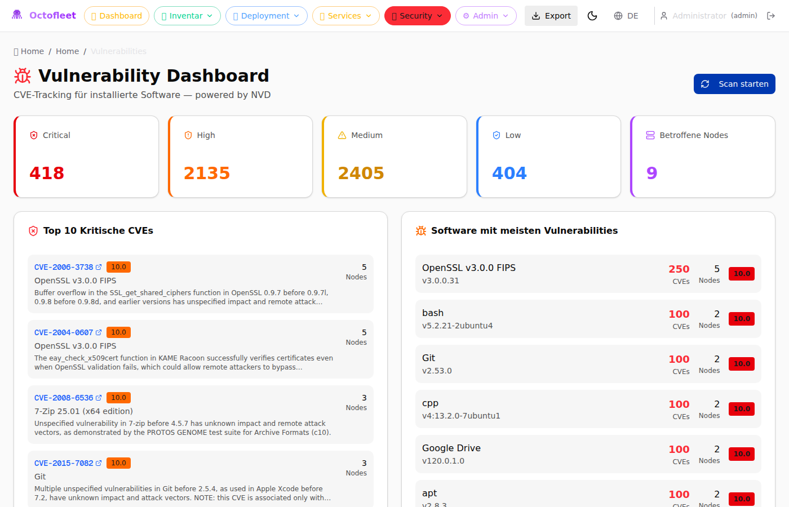
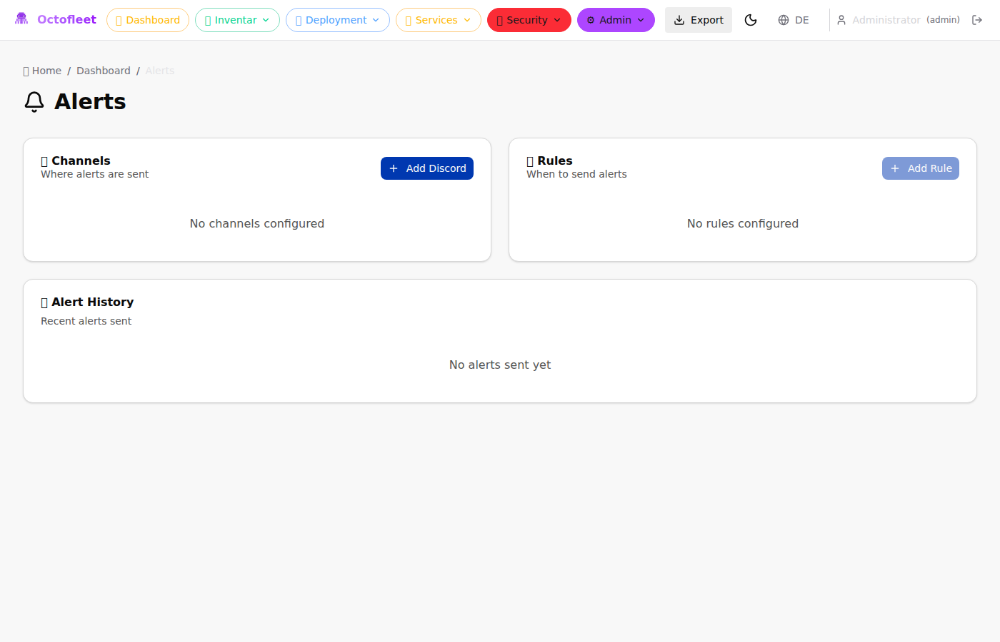

# 🐙 Octofleet

<p align="center">
  
</p>

**Open-source endpoint management platform** for Windows and Linux systems. Monitor your fleet, deploy software, track vulnerabilities, and manage devices from a single dashboard.

[](LICENSE)
[](https://github.com/BenediktSchackenberg/octofleet/releases)

---

## ✨ Features

### 📊 Inventory & Monitoring
- **Real-time dashboard** with fleet overview
- **Hardware inventory** (CPU, RAM, Disks, Network)
- **Software inventory** with version tracking
- **Performance metrics** (CPU, RAM, Disk usage)
- **Live view** with process and network monitoring

### 🚀 Deployment & Management
- **Remote job execution** (PowerShell, CMD, Bash)
- **Package management** with deployment tracking
- **Rollout strategies** (Canary, Staged, Percentage)
- **Maintenance windows** for controlled deployments
- **Auto-remediation** for vulnerable software

### 🔐 Security
- **Vulnerability scanning** via NVD API
- **CVSS scoring** with severity badges
- **Windows Update tracking**
- **Browser extension inventory**
- **Role-based access control** (RBAC)

### 🔔 Alerts & Notifications
- **Discord webhook integration**
- **Node offline/online alerts**
- **Job failure notifications**
- **Configurable alert rules**

### 🖥️ Remote Access
- **Screen mirroring** (live view of remote desktops)
- **Remote terminal** (PowerShell/CMD/Bash in browser)
- **Event log viewer**

---

## 🏗️ Architecture

```
┌─────────────────┐     ┌─────────────────┐     ┌─────────────────┐
│   Web Frontend  │────▶│  Backend API    │────▶│   PostgreSQL    │
│   (Next.js)     │     │  (FastAPI)      │     │  + TimescaleDB  │
└─────────────────┘     └─────────────────┘     └─────────────────┘
                               ▲
                               │
              ┌────────────────┼────────────────┐
              │                │                │
       ┌──────┴──────┐  ┌──────┴──────┐  ┌──────┴──────┐
       │  Windows    │  │  Windows    │  │   Linux     │
       │   Agent     │  │   Agent     │  │   Agent     │
       └─────────────┘  └─────────────┘  └─────────────┘
```

---

## 🚀 Quick Start

### Prerequisites
- Docker & Docker Compose
- Node.js 18+ (for frontend development)
- Python 3.11+ (for backend development)

### 1. Clone & Configure

```bash
git clone https://github.com/BenediktSchackenberg/octofleet.git
cd octofleet

# Copy environment templates
cp .env.example .env
cp frontend/.env.example frontend/.env.local

# Edit .env with your settings
nano .env
```

### 2. Start with Docker

```bash
# Start PostgreSQL + TimescaleDB
docker-compose up -d db

# Run database migrations
python backend/migrate.py

# Start backend
cd backend && pip install -r requirements.txt && uvicorn main:app --host 0.0.0.0 --port 8080

# Start frontend (new terminal)
cd frontend && npm install && npm run dev
```

### 3. Install Agents

**Windows (PowerShell as Admin):**
```powershell
irm https://raw.githubusercontent.com/BenediktSchackenberg/octofleet/main/scripts/Install-OpenClawAgent.ps1 | iex
```

**Linux:**
```bash
curl -sSL https://raw.githubusercontent.com/BenediktSchackenberg/octofleet/main/linux-agent/install.sh | sudo bash
```

---

## 📖 Documentation

| Topic | Link |
|-------|------|
| Installation Guide | [Wiki: Installation](../../wiki/Installation) |
| Configuration | [Wiki: Configuration](../../wiki/Configuration) |
| API Reference | [Wiki: API-Reference](../../wiki/API-Reference) |
| Agent Setup | [Wiki: Agent-Configuration](../../wiki/Agent-Configuration) |
| Troubleshooting | [Wiki: Troubleshooting](../../wiki/Troubleshooting) |

---

## 📸 Screenshots

<details>
<summary>📈 Dashboard</summary>

</details>

<details>
<summary>🖥️ Node Details</summary>

</details>

<details>
<summary>🔒 Vulnerability Scanner</summary>

</details>

<details>
<summary>🔔 Alerts</summary>

</details>

---

## 🛠️ Development

### Backend (FastAPI)
```bash
cd backend
python -m venv venv
source venv/bin/activate  # or venv\Scripts\activate on Windows
pip install -r requirements.txt
uvicorn main:app --reload --host 0.0.0.0 --port 8080
```

### Frontend (Next.js)
```bash
cd frontend
npm install
npm run dev
```

### Windows Agent (.NET 8)
```bash
cd src/OpenClawAgent.Service
dotnet build
dotnet run
```

### Run Tests
```bash
# API Tests
cd tests/api && pytest

# E2E Tests
cd tests/e2e && npx playwright test

# Windows Agent Tests
cd tests/windows && ./Run-LocalTests.ps1
```

---

## 🤝 Contributing

Contributions are welcome! Please read our [Contributing Guide](CONTRIBUTING.md) first.

1. Fork the repository
2. Create a feature branch (`git checkout -b feature/amazing-feature`)
3. Commit your changes (`git commit -m 'Add amazing feature'`)
4. Push to the branch (`git push origin feature/amazing-feature`)
5. Open a Pull Request

---

## 📄 License

This project is licensed under the MIT License - see the [LICENSE](LICENSE) file for details.

---

## 🙏 Acknowledgments

- Built with [FastAPI](https://fastapi.tiangolo.com/), [Next.js](https://nextjs.org/), and [.NET 8](https://dotnet.microsoft.com/)
- Vulnerability data from [NVD](https://nvd.nist.gov/)
- Icons by [Lucide](https://lucide.dev/)

---

<p align="center">
  <b>🐙 Reach every endpoint in your fleet</b><br>
  Made with ❤️ by <a href="https://schackenberg.com">Benedikt Schackenberg</a>
</p>
