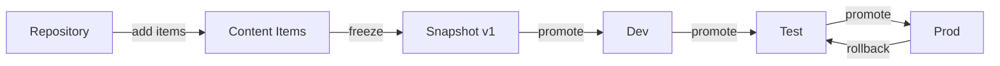

# 📦 Content Repository & Lifecycle Management

> Introduced in **v0.6.0** (Epic E33)

Manage software repositories, content snapshots, and environment-based promotion pipelines — from Dev through Test to Production.

## Overview



The Content Lifecycle system provides:

- **Repository Management** — Create and manage repositories for APT, YUM, Chocolatey, NuGet, WinGet, or generic content
- **Content Items** — Track individual packages/artifacts within repositories
- **Snapshots** — Freeze a repository's state at a point in time
- **Environment Pipeline** — Promote snapshots through Dev → Test → Prod stages
- **Snapshot Diff** — Compare two snapshots to see what changed
- **Dashboard** — Overview of all repositories, environments, and recent activity

---

## Concepts

### Repositories

A repository represents a package source. Supported types:

| Type | Description |
|------|-------------|
| `apt` | Debian/Ubuntu APT repository |
| `yum` | Red Hat/CentOS YUM repository |
| `chocolatey` | Windows Chocolatey feed |
| `nuget` | NuGet package feed |
| `winget` | Windows Package Manager source |
| `generic` | Any custom content repository |

Each repository has a name, type, URL, and optional sync configuration.

### Content Items

Items are individual packages or artifacts within a repository. Each item has:
- Name, version, architecture
- Size, checksum
- Metadata (description, dependencies)

Items can be added manually or discovered via repository sync (`POST /repositories/{repo_id}/sync`).

### Snapshots

A snapshot freezes the current state of a repository — the exact set of items and their versions. Snapshots are immutable once created. Use them to:

- **Track changes** over time
- **Compare** versions (snapshot diff)
- **Promote** known-good sets of packages through environments

### Environments

Environments represent stages in your deployment pipeline. The default pipeline is:

| Environment | Purpose |
|-------------|---------|
| **Dev** | Initial testing and validation |
| **Test** | QA and integration testing |
| **Prod** | Production deployment |

Each environment is pinned to a specific snapshot. Promoting means assigning a snapshot from a lower environment to the next one.

### Rollback

If a promoted snapshot causes issues, you can roll back an environment to its previous snapshot. The system keeps a history of all promotions and rollbacks.

---

## API Reference

### Repositories

| Method | Path | Description |
|--------|------|-------------|
| GET | `/api/v1/content/repositories` | List all repositories |
| POST | `/api/v1/content/repositories` | Create repository |
| GET | `/api/v1/content/repositories/{repo_id}` | Get repository details |
| PUT | `/api/v1/content/repositories/{repo_id}` | Update repository |
| DELETE | `/api/v1/content/repositories/{repo_id}` | Delete repository |
| POST | `/api/v1/content/repositories/{repo_id}/sync` | Trigger repository sync |

### Content Items

| Method | Path | Description |
|--------|------|-------------|
| GET | `/api/v1/content/repositories/{repo_id}/items` | List items in repo (with search, pagination) |
| POST | `/api/v1/content/repositories/{repo_id}/items` | Add item to repository |
| GET | `/api/v1/content/items/{item_id}` | Get item details |
| DELETE | `/api/v1/content/items/{item_id}` | Delete item |

### Snapshots

| Method | Path | Description |
|--------|------|-------------|
| GET | `/api/v1/content/snapshots` | List snapshots (filter by repo) |
| POST | `/api/v1/content/repositories/{repo_id}/snapshots` | Create snapshot of repository |
| GET | `/api/v1/content/snapshots/{snap_id}` | Get snapshot details with items |
| DELETE | `/api/v1/content/snapshots/{snap_id}` | Delete snapshot |
| GET | `/api/v1/content/snapshots/{snap_id}/diff/{other_id}` | Compare two snapshots |

### Environments

| Method | Path | Description |
|--------|------|-------------|
| GET | `/api/v1/content/environments` | List all environments |
| PUT | `/api/v1/content/environments/{env_id}` | Update environment settings |
| POST | `/api/v1/content/environments/{env_id}/promote` | Promote snapshot to environment |
| GET | `/api/v1/content/environments/{env_id}/history` | Promotion/rollback history |
| POST | `/api/v1/content/environments/{env_id}/rollback` | Rollback to previous snapshot |

### Dashboard

| Method | Path | Description |
|--------|------|-------------|
| GET | `/api/v1/content/dashboard` | Content lifecycle overview |

---

## Workflow Example

```bash
# 1. Create a Chocolatey repository
curl -X POST -H "X-API-Key: $KEY" -H "Content-Type: application/json" \
  -d '{"name": "Internal Choco", "type": "chocolatey", "url": "https://choco.internal/nuget"}' \
  http://localhost:8080/api/v1/content/repositories

# 2. Add items (or sync from source)
curl -X POST -H "X-API-Key: $KEY" -H "Content-Type: application/json" \
  -d '{"name": "googlechrome", "version": "122.0.6261.94", "arch": "x64"}' \
  http://localhost:8080/api/v1/content/repositories/{repo_id}/items

# 3. Create a snapshot
curl -X POST -H "X-API-Key: $KEY" -H "Content-Type: application/json" \
  -d '{"name": "March 2026 Baseline"}' \
  http://localhost:8080/api/v1/content/repositories/{repo_id}/snapshots

# 4. Promote to Dev
curl -X POST -H "X-API-Key: $KEY" -H "Content-Type: application/json" \
  -d '{"snapshot_id": "..."}' \
  http://localhost:8080/api/v1/content/environments/{dev_env_id}/promote

# 5. After testing, promote to Prod
curl -X POST -H "X-API-Key: $KEY" -H "Content-Type: application/json" \
  -d '{"snapshot_id": "..."}' \
  http://localhost:8080/api/v1/content/environments/{prod_env_id}/promote

# 6. Something went wrong? Rollback.
curl -X POST -H "X-API-Key: $KEY" \
  http://localhost:8080/api/v1/content/environments/{prod_env_id}/rollback
```
